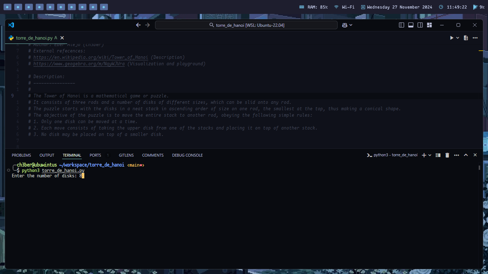

# Tower of Hanoi

The Tower of Hanoi is a mathematical game or puzzle.
It consists of three rods and a number of disks of different sizes, which can be slid onto any rod.
The puzzle starts with the disks in a neat stack in ascending order of size on one rod, the smallest at the top, thus making a conical shape.

The objective of the puzzle is to move the entire stack to another rod, obeying the following simple rules:
1. Only one disk can be moved at a time.
2. Each move consists of taking the upper disk from one of the stacks and placing it on top of another stack.
3. No disk may be placed on top of a smaller disk.

## Screenshots

## External refecences:
- https://en.wikipedia.org/wiki/Tower_of_Hanoi (Description)
- https://www.geogebra.org/m/NqyWJVra (Visualization and playground)

## Author
- [@ch3ber](https://www.github.com/ch3ber)
